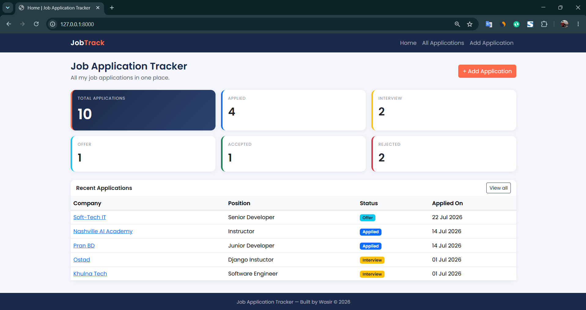
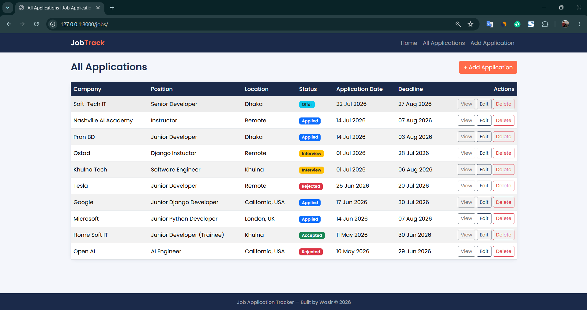
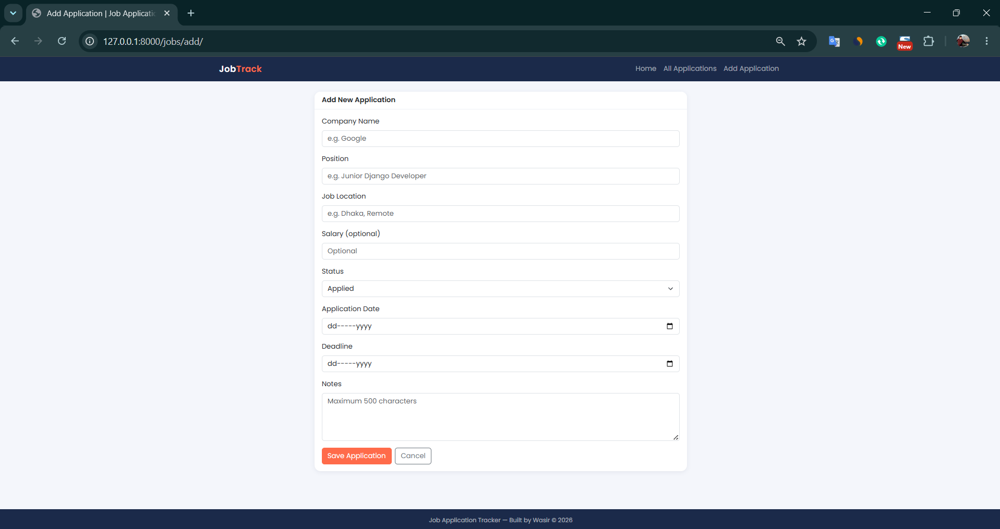
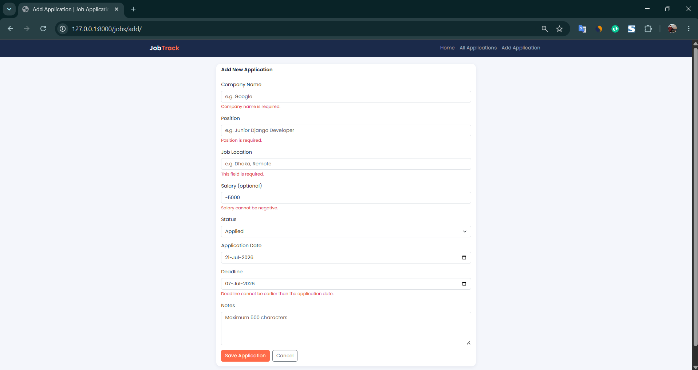
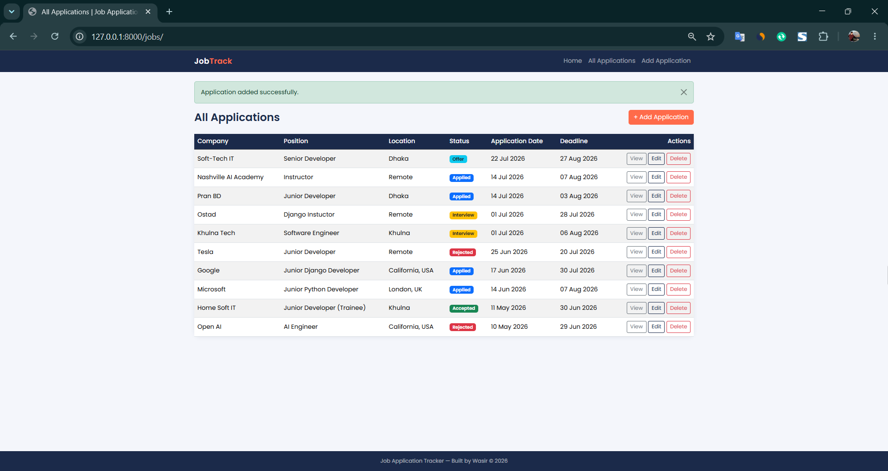
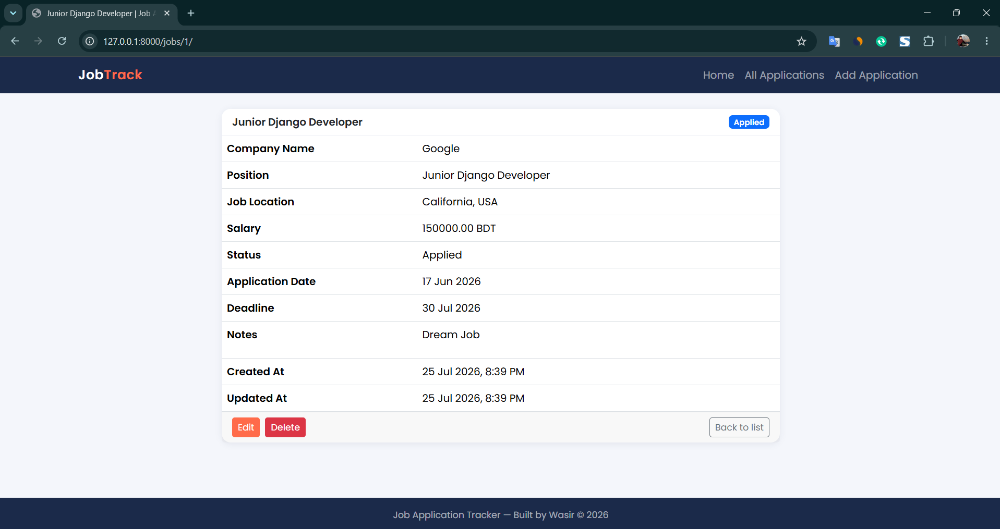
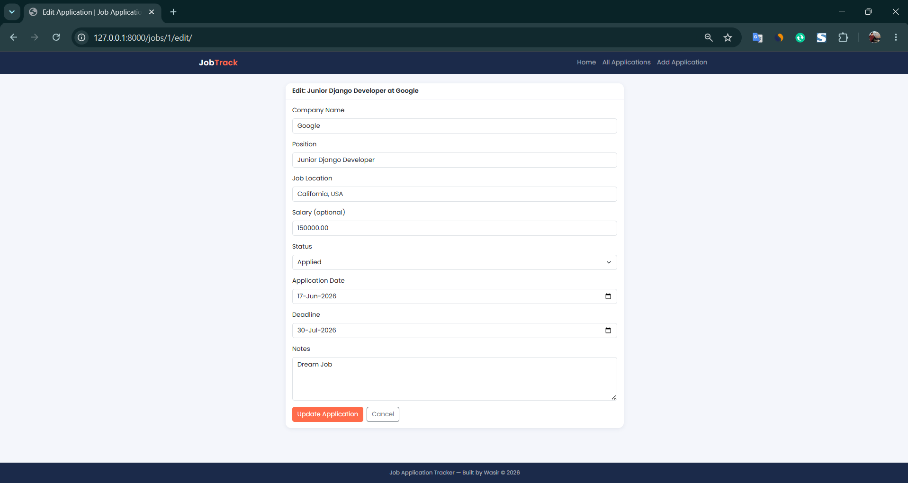
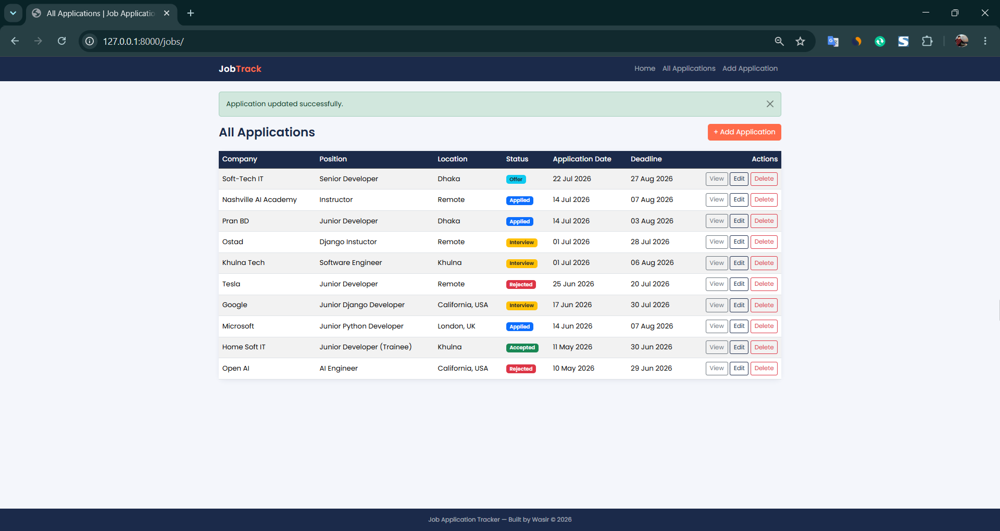
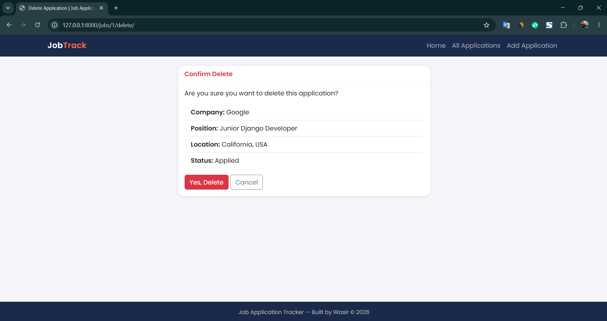
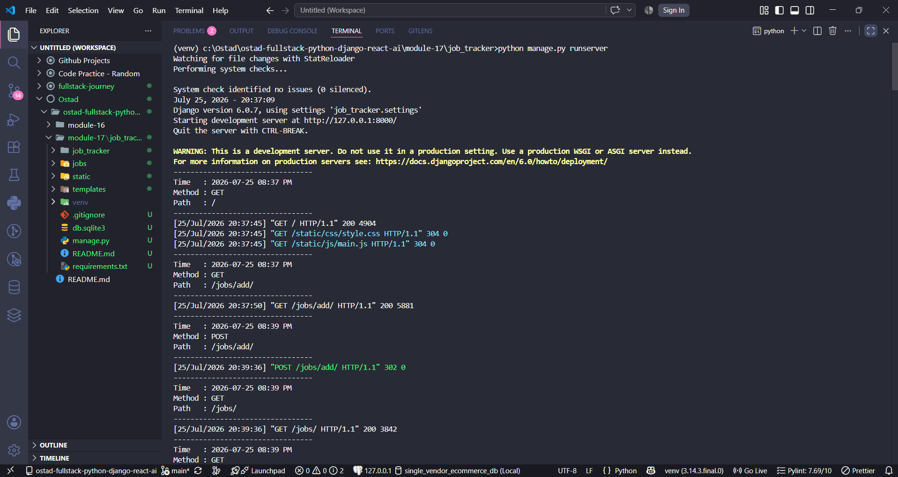

# Job Application Tracker

A Django CRUD project to keep track of job applications (Module 17 assignment).

## Features

- Dashboard with total applications and a count for each status
- Full CRUD: list, add, edit, delete (with confirmation page) and detail page
- ModelForm with custom validation and errors shown under each field
- Custom `RequestLoggerMiddleware` that logs time, method and path of every request
- Template inheritance with `base.html`, plus navbar and footer includes
- Bootstrap 5 with my own custom CSS theme
- Success messages after add, edit and delete

## How to run

```bash
python -m venv venv
venv\Scripts\activate
pip install -r requirements.txt
python manage.py migrate
python manage.py runserver
```

Then open http://127.0.0.1:8000/

To use the admin panel:

```bash
python manage.py createsuperuser
```

## URLs

| URL | Page |
|---|---|
| `/` | Home dashboard |
| `/jobs/` | All applications |
| `/jobs/add/` | Add application |
| `/jobs/<id>/` | Application detail |
| `/jobs/<id>/edit/` | Edit application |
| `/jobs/<id>/delete/` | Delete confirmation |

## Validation rules

- Company name is required
- Position is required
- Salary cannot be negative
- Deadline cannot be earlier than the application date
- Notes cannot exceed 500 characters

## Middleware output

```
---------------------------------
Time   : 2026-07-25 06:39 PM
Method : GET
Path   : /jobs/
---------------------------------
```

## Screenshots

### 1. Home Dashboard
Total applications and count of each status.



### 2. All Applications
All applications in a table with Company, Position, Location, Status, Application Date, Deadline and Actions.



### 3. Add Application Form
ModelForm used to create a new application.



### 4. Form Validation
Validation errors are shown below each field. Company name and position are required, salary cannot be negative and the deadline cannot be earlier than the application date.



### 5. Success Message After Create
Django message framework shows a success message after adding an application.



### 6. Application Detail
All information of a single application, including created and updated time.



### 7. Edit Application Form
The form is pre-filled with the existing values of the application.



### 8. Success Message After Update



### 9. Delete Confirmation
A confirmation page is shown before the application is deleted.



### 10. Custom Middleware Logs
RequestLoggerMiddleware prints the time, method and path of every request in the terminal.



