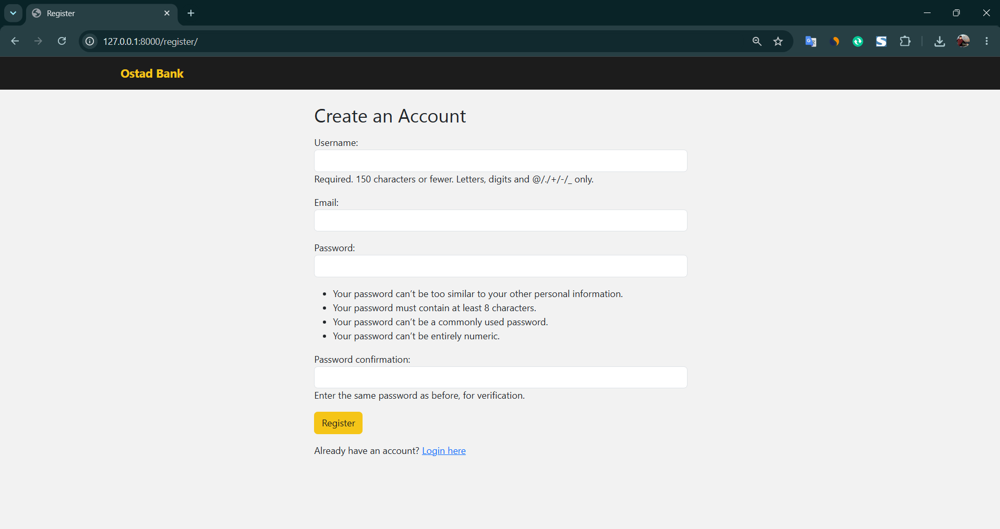
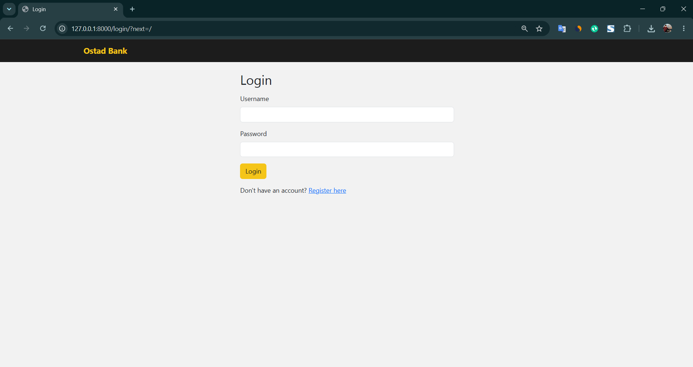
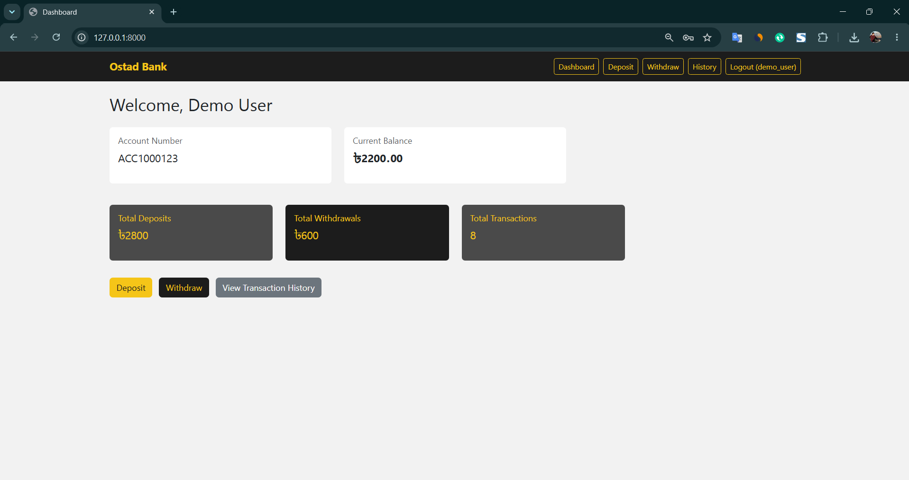
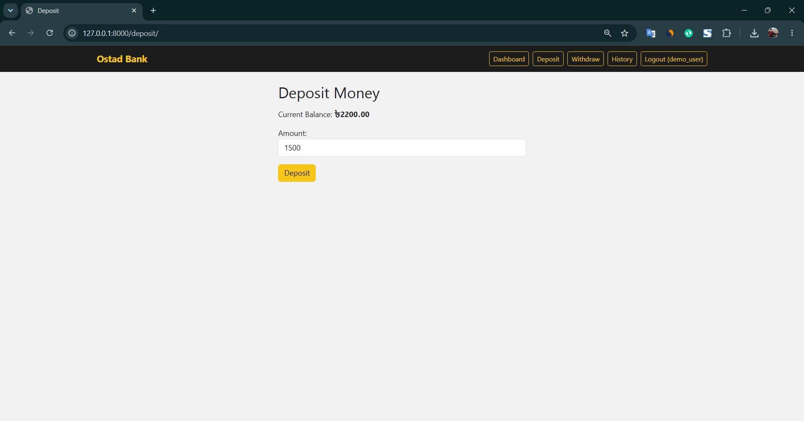
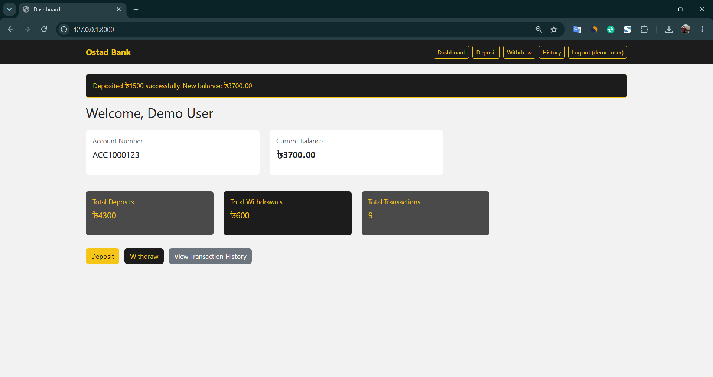
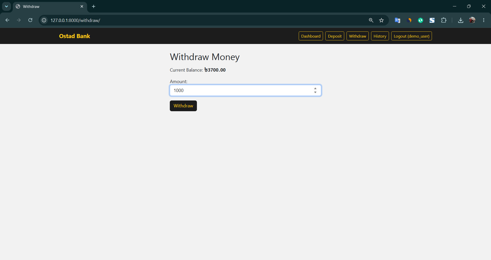
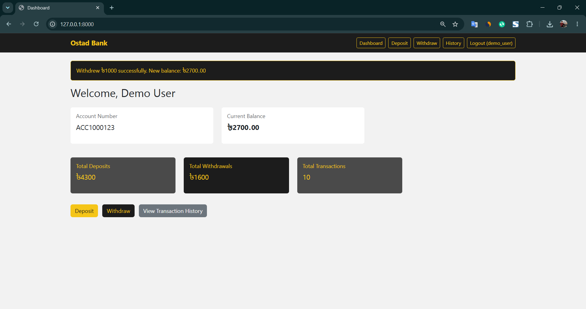
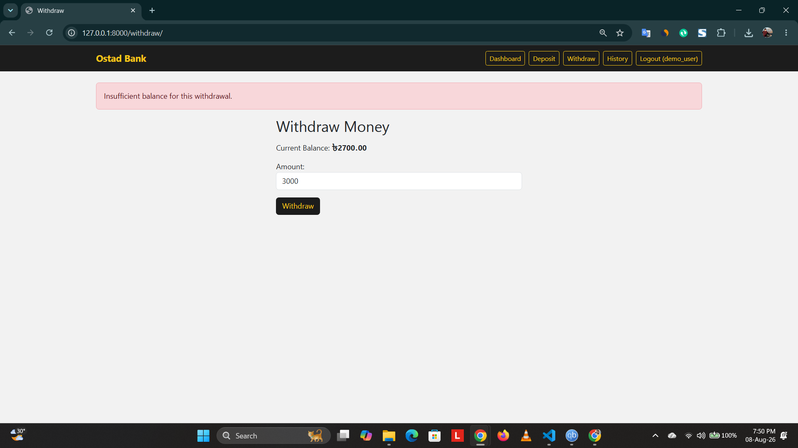
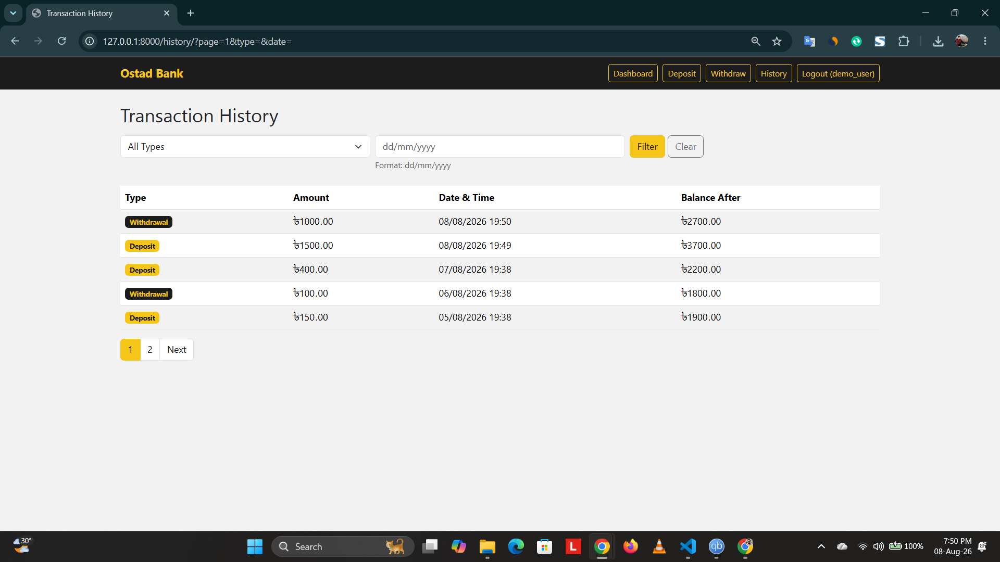
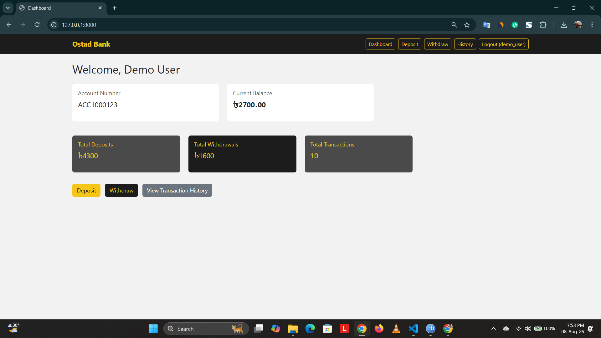

# Bank Account Transaction Management System (Ostad Bank)

A simple Django app for a bank account assignment, branded as "Ostad Bank"
with a yellow/black/grey theme. Logged-in users can create one bank account,
deposit/withdraw money, and view their transaction history.

## Features

- User registration, login, logout (Django's built-in auth)
- Each user has exactly one bank account, and can only ever see their own
  account/transactions (everything is filtered by `request.user`)
- Deposit and withdraw money, with overdraft prevention on withdrawals
- Dashboard showing current balance, total deposits, total withdrawals, and
  total transaction count (calculated with Django ORM aggregates)
- Transaction history, newest first, with search by type and filter by date
- All amounts shown in BDT (Bangladeshi Taka), displayed as ৳ in the UI
- Dates shown in dd/mm/yyyy format, timestamps displayed in Dhaka time (GMT+6)

### Bonus (2 of 6 implemented)

- **Pagination** — transaction history is paginated, 5 transactions per page
- **Bootstrap UI** — styled with Bootstrap 5 (via CDN) plus a custom
  yellow/black/grey theme (see `bank/static/bank/custom.css`)

## Tech Stack

- Python 3.11
- Django 5.2
- SQLite (Django's default database)
- Bootstrap 5 (CDN, no npm/build step)

## Project Structure

```
django-bank-transactions/
├── bankproject/        # Django project settings/urls
├── bank/               # the actual app
│   ├── models.py       # BankAccount, Transaction
│   ├── views.py        # all the views (function-based)
│   ├── forms.py        # register form, account form, deposit/withdraw forms
│   ├── urls.py
│   ├── admin.py
│   ├── management/commands/seed_data.py   # seeds demo data
│   └── templates/bank/
├── manage.py
├── requirements.txt
├── screenshots/         # UI screenshots for submission
└── db.sqlite3          # sample database with demo data already in it
```

## Screenshots

All screenshots below were taken using the seeded `demo_user` account, in one
session, so the numbers stay consistent from one screenshot to the next.

1. **Registration**
   New user sign-up form.
   

2. **Login**
   Login form.
   

3. **Dashboard**
   Current balance and totals right after logging in.
   

4. **Deposit**
   Depositing money into the account.
   

5. **Dashboard after Deposit**
   Balance and totals updated after the deposit.
   

6. **Withdraw**
   Withdrawing money from the account.
   

7. **Dashboard after Withdraw**
   Balance and totals updated after the withdrawal.
   

8. **Overdraft Prevention**
   Trying to withdraw more than the current balance - rejected with an
   error message, balance stays unchanged.
   

9. **Transaction History**
   Newest first, showing the deposit and withdrawal made above along with
   the balance after each transaction.
   

10. **Final Dashboard**
    Dashboard at the end of the session, reflecting every transaction shown
    in the screenshots above.
    

## Models

- **BankAccount** — one-to-one with Django's `User`. Stores account holder
  name, account number, and current balance.
- **Transaction** — foreign key to `BankAccount` (one account, many
  transactions). Stores type (deposit/withdrawal), amount, balance after the
  transaction, and a timestamp.

## Setup Instructions

1. Clone the repo and navigate into this assignment's folder:
   ```
   git clone https://github.com/wasir-codes/ostad-fullstack-python-django-react-ai.git
   cd ostad-fullstack-python-django-react-ai/module-19/django-bank-transactions
   ```

2. Create a virtual environment and install dependencies:
   ```
   python -m venv venv
   source venv/bin/activate      # on Windows: venv\Scripts\activate
   pip install -r requirements.txt
   ```

3. Run migrations (the sample `db.sqlite3` is already included, but this is
   safe to run anyway):
   ```
   python manage.py migrate
   ```

4. (Optional) Seed some sample data if you want a fresh demo account:
   ```
   python manage.py seed_data
   ```
   This creates a user `demo_user` with password `DemoPass123`, an account,
   and 8 sample transactions.

5. Run the server:
   ```
   python manage.py runserver
   ```

6. Open `http://127.0.0.1:8000/` in your browser. You'll be redirected to the
   login page. Either log in with the seeded demo account above, or click
   "Register here" to create your own.

### Admin login (for checking the database directly)

If you want to look at the data through Django admin, create a superuser:
```
python manage.py createsuperuser
```
then visit `http://127.0.0.1:8000/admin/`.

## Notes / Assumptions

- Each user gets exactly one bank account (the assignment says "manage their
  own bank account", singular), enforced with a `OneToOneField`.
- Balances and amounts use `DecimalField` instead of floats to avoid rounding
  weirdness with money.
- "Prevent overdraft" is implemented as a simple check in the withdraw view:
  if the withdrawal amount is more than the current balance, it's rejected
  with an error message and nothing is saved.
- The search/filter form on the transaction history page uses GET so the
  filters can be combined with pagination via the URL query string.
- `TIME_ZONE` in settings.py is set to `Asia/Dhaka` so all displayed
  timestamps are in Dhaka time (GMT+6). Django still stores everything in
  UTC internally (`USE_TZ = True`) and converts for display, which is the
  standard/recommended way to handle timezones in Django.
