# JobTrack AI — AI-Powered Job Application Tracker

A Django web application where users manage and track their job
applications from a dashboard, and use AI to analyze job descriptions.
Built for the Module 20 assignment.

## Core Features

**User Authentication**
- Registration, login, logout (Django's built-in auth)
- Every user only sees and manages their own applications

**Job Application Management**
- Full CRUD: create, list, detail view, edit, delete
- Fields: Job Title, Company Name, Job Description, Location, Salary, Job
  URL, Application Date, Status, Notes

**Application Status**
- Fixed sequence: Wishlist → Applied → Screening → Interview →
  Selected / Rejected

**Search & Filtering**
- Search by job title/company
- Filter by status
- Filter by location
- Categories & Tags (own models, used as a filter)

**Interview Management**
- Interview Date & Time, Interview Type, Meeting Link, Interview Notes
- Tied to a specific job application

**AI Features**
- AI Job Description Analyzer: paste a job description and get back a Job
  Summary, Required Skills, Required Experience, Important Technologies,
  and Interview Preparation Suggestions

**Dashboard**
- Total Applications, Applications by Status, Recent Applications, Upcoming
  Interviews

## Tech Stack

- Python 3.11, Django 4.2
- SQLite (Django's default database)
- Bootstrap 5 (CDN, no build step)
- [OpenRouter](https://openrouter.ai/) for the AI API call (OpenAI-compatible
  API with free models, so running this costs nothing)
- `python-decouple` for reading settings from `.env`

## Project Structure

```
ai-job-application-tracker/
├── jobtracker/                  # Django project settings/urls
│   ├── settings.py
│   ├── urls.py
│   └── wsgi.py / asgi.py
├── tracker/                     # the app
│   ├── models.py                # Category, Tag, JobApplication, Interview, JobAnalysis
│   ├── views.py                 # all views (function-based)
│   ├── forms.py                 # register form, application form, interview form
│   ├── ai_analyzer.py           # the OpenRouter API call + response parsing
│   ├── urls.py
│   ├── admin.py
│   ├── migrations/
│   ├── management/commands/seed_data.py   # seeds demo data
│   └── templates/tracker/       # all page templates (dashboard, forms, etc.)
├── screenshots/                 # 14 UI screenshots, referenced below
├── manage.py
├── requirements.txt
├── .gitignore
├── .env.example                 # copy to .env and fill in your own key
└── db.sqlite3                   # created after running migrate (not in the repo)
```

## Models

- **Category** — a broad bucket for a job (e.g. "Backend", "Data"). One per
  application (`ForeignKey`).
- **Tag** — freeform labels (e.g. "Remote", "Django"). Many per application
  (`ManyToManyField`).
- **JobApplication** — the main model. `ForeignKey` to Django's `User`
  (`related_name='applications'`).
- **Interview** — `ForeignKey` to `JobApplication`
  (`related_name='interviews'`). One application can have several
  interviews.
- **JobAnalysis** — `OneToOneField` to `JobApplication`. Stores the AI
  analyzer's result so re-running the analysis overwrites it instead of
  duplicating it.

## Setup Instructions

1. Clone the repo and navigate into this assignment's folder:
   ```
   git clone https://github.com/wasir-codes/ostad-fullstack-python-django-react-ai.git
   cd ostad-fullstack-python-django-react-ai/module-20/ai-job-application-tracker
   ```

2. Create a virtual environment and install dependencies:
   ```
   python -m venv venv
   source venv/bin/activate      # on Windows: venv\Scripts\activate
   pip install -r requirements.txt
   ```

3. Set up the `.env` file (needed for the AI feature; everything else runs
   fine even without it — see **Setting up the API key** below):
   ```
   cp .env.example .env          # Mac/Linux/Git Bash/PowerShell
   copy .env.example .env        # Windows Command Prompt (cmd.exe)
   ```

4. Run migrations:
   ```
   python manage.py migrate
   ```

5. (Optional) Seed sample data:
   ```
   python manage.py seed_data
   ```
   Creates a `demo_user` account (password: `demo12345`) with 4 sample
   applications and 1 upcoming interview.

6. Run the server:
   ```
   python manage.py runserver
   ```

7. Open `http://127.0.0.1:8000/` in your browser. You'll be redirected to
   login — use the seeded `demo_user` account, or register a new one.

### Admin login (optional)

```
python manage.py createsuperuser
```
then visit `http://127.0.0.1:8000/admin/`.

## Setting Up the API Key

This app calls [OpenRouter](https://openrouter.ai/) for the AI Job
Description Analyzer. **No API key is included in this repository** — per
the assignment requirements, keys and passwords are never uploaded to
GitHub.

1. Create a free account at [openrouter.ai](https://openrouter.ai) and
   generate a key at [openrouter.ai/keys](https://openrouter.ai/keys).
2. Copy `.env.example` to `.env` (see step 3 above).
3. Open `.env` and paste your key in:
   ```
   OPENROUTER_API_KEY=sk-or-v1-your-actual-key-here
   ```
4. `OPENROUTER_MODEL` is also set in `.env`, defaulting to a free model
   (`openai/gpt-oss-20b:free`), so testing this feature costs nothing.
   OpenRouter's free model list changes over time — check
   [openrouter.ai/models](https://openrouter.ai/models) and filter for
   `:free` if the default stops working, then update the line in `.env`.

**How it works:** `tracker/ai_analyzer.py` sends the job description to
OpenRouter's `/chat/completions` endpoint (a plain HTTP POST via the
`requests` library, no SDK) with a system prompt asking for a JSON reply
with exactly five keys: summary, required_skills, required_experience,
important_technologies, interview_prep. The response is parsed into those
fields and saved on the `JobAnalysis` model. If the configured model fails
(e.g. a temporary rate limit on OpenRouter's free tier), it automatically
retries once with a backup free model before showing an error.

If `.env` has no key, the AI Analysis page shows a clear error message
instead of crashing — every other feature works normally without it.

## Required UI Pages

| Page | URL |
|---|---|
| Registration | `/register/` |
| Login | `/login/` |
| Dashboard | `/` |
| Application List | `/applications/` |
| Application Details | `/applications/<id>/` |
| Create/Edit Application | `/applications/new/`, `/applications/<id>/edit/` |
| AI Analysis | `/applications/<id>/analysis/` |

## Screenshots

1. **Registration**
   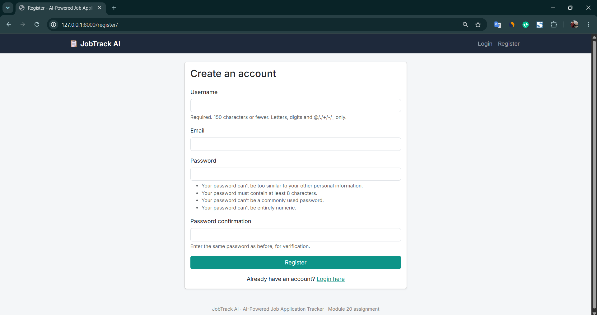

2. **Login**
   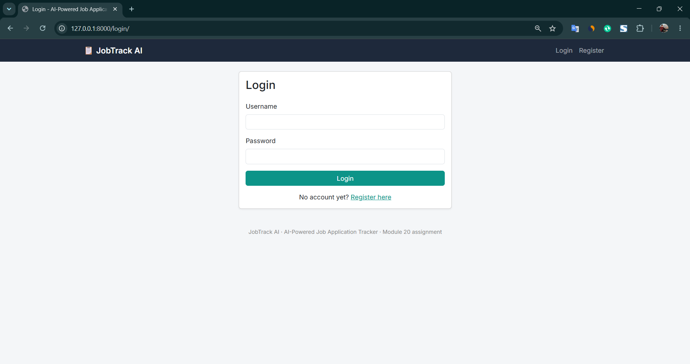

3. **Dashboard** — total applications, applications by status, recent
   applications, upcoming interviews
   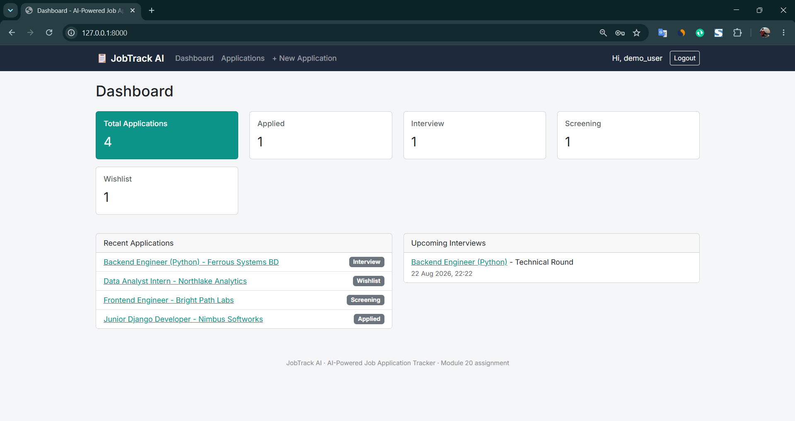

4. **Application List**
   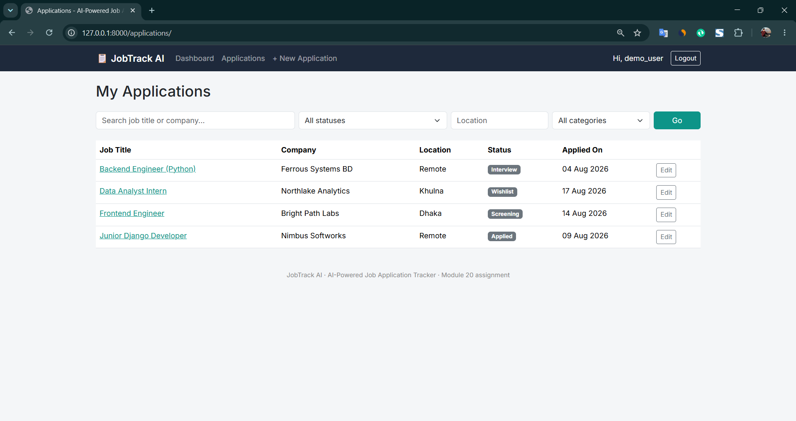

5. **Search & Filter** — filtered by category
   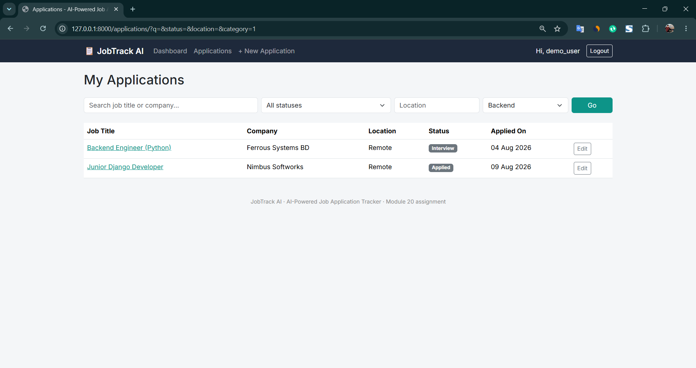

6. **Application Details** — fields, category, tags, linked interview, and
   the AI analysis entry point
   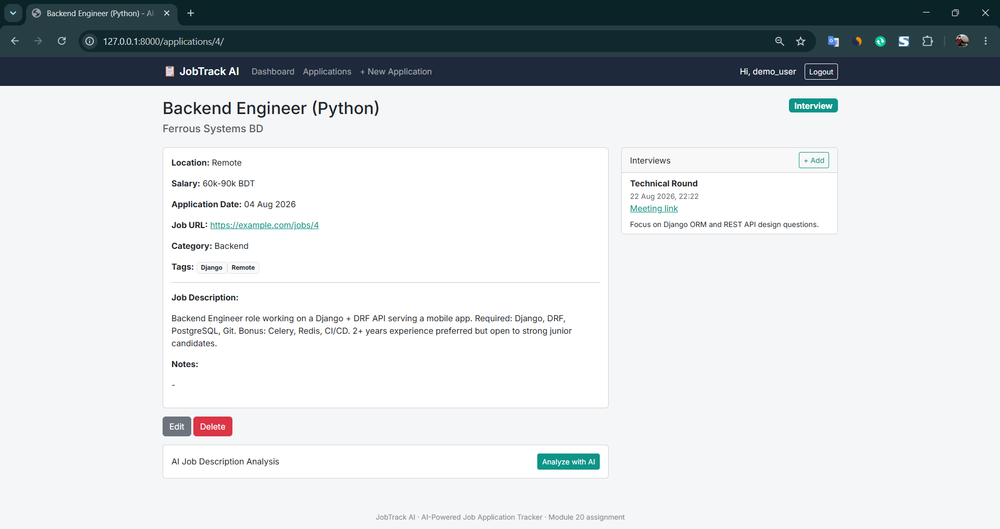

7. **Create Application**
   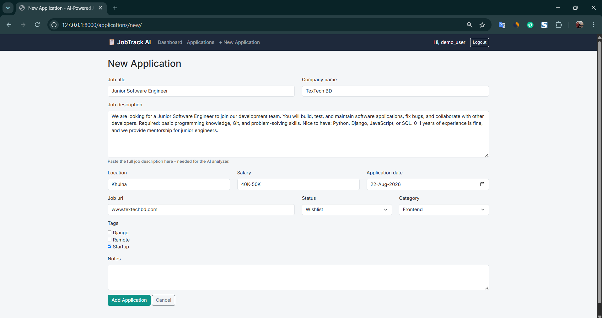

8. **Edit Application**
   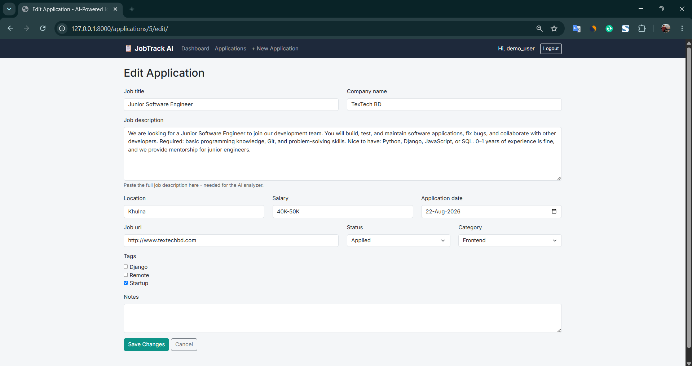

9. **Application Updated** — after editing, showing the new status
   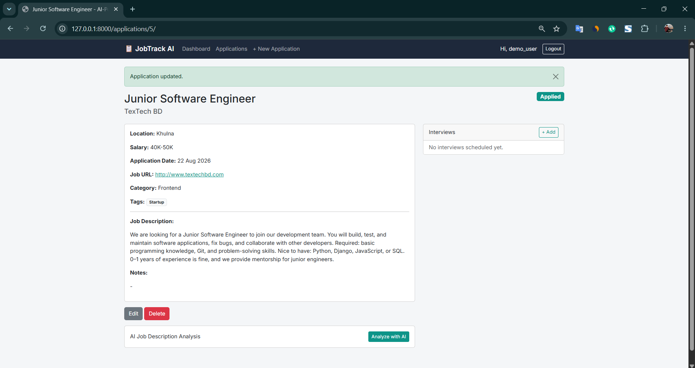

10. **Add Interview**
    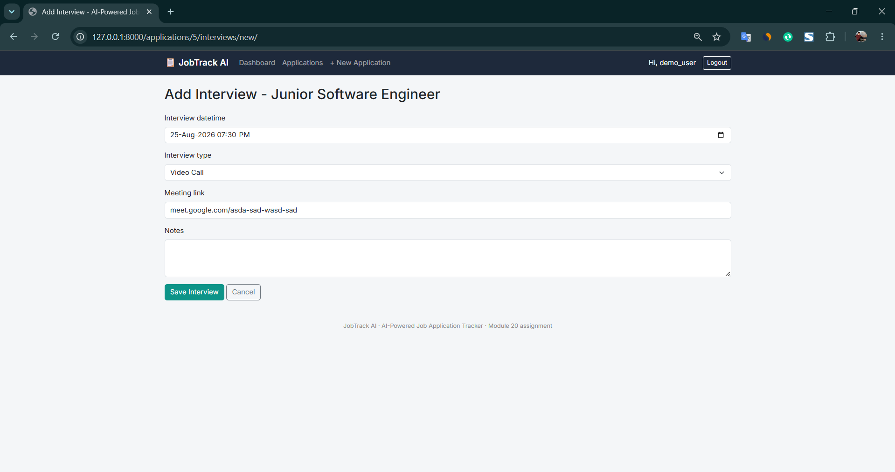

11. **AI Analysis — before running** — empty state when no analysis exists yet
    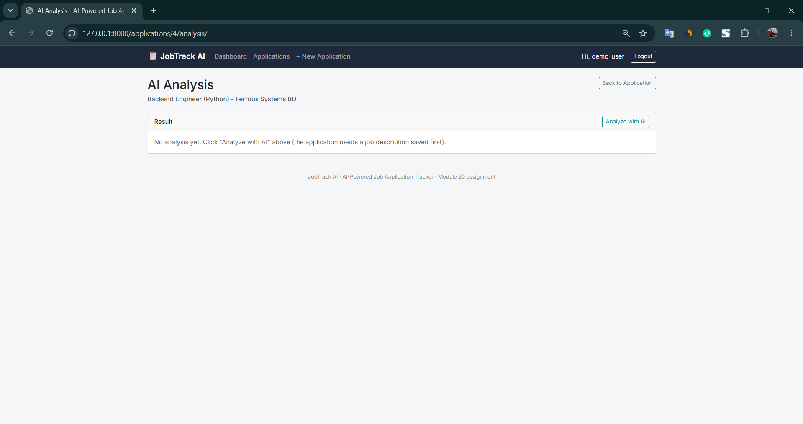

12. **AI Analysis — confirm** — the job description about to be sent to the AI
    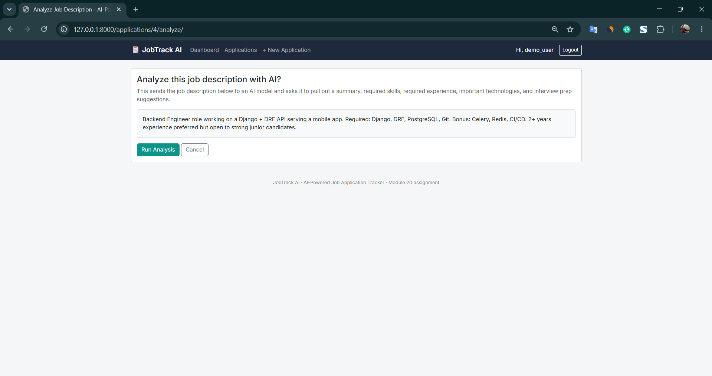

13. **AI Analysis — result** — Job Summary, Required Skills, Required
    Experience, Important Technologies, Interview Preparation Suggestions
    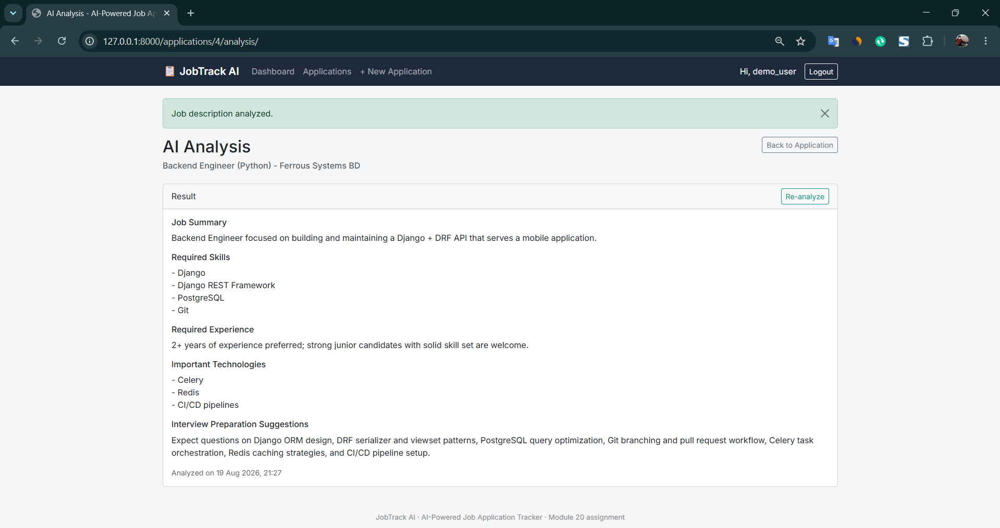

14. **Django Admin** — all 5 models registered for direct inspection
    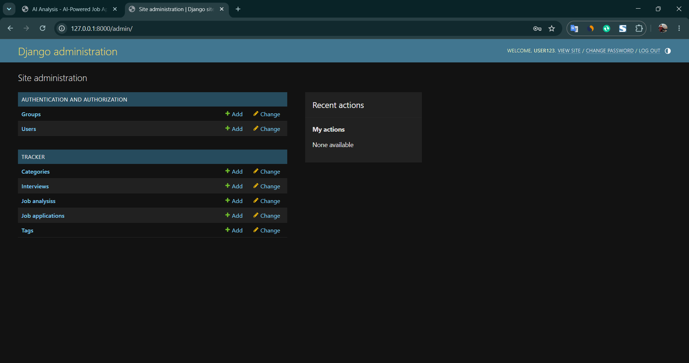

## Notes / Design Decisions

- Status is a `CharField` with `choices` in the required sequence. The
  database doesn't force moving through the sequence in order — a job can
  be rejected at any stage, which matches how job hunting actually works.
- `job_url` and `meeting_link` use a plain text input instead of an
  `<input type="url">`. Browsers reject a bare domain like
  `www.example.com` on that input type before the form is even submitted;
  Django's own `URLField` validation is more forgiving and normalizes it
  to a working link, so the plain text box lets that validation do its
  job instead of being blocked earlier by the browser.
- The AI analysis result is stored on the `JobAnalysis` model rather than
  re-fetched every page load, so it's still visible even if the API is
  temporarily unavailable.

## Django Concepts Used

Matches the assignment's suggested concepts:

- Models & Django ORM
- CRUD Operations
- Forms / ModelForms
- Authentication & Authorization
- Model Relationships (`ForeignKey`, `ManyToManyField`, `OneToOneField`,
  `related_name`)
- Search & Filtering (`Q` objects, `.filter()` chains, ORM aggregates for
  the dashboard)
- Templates (inheritance, template tags, filters)
- External AI API Integration
